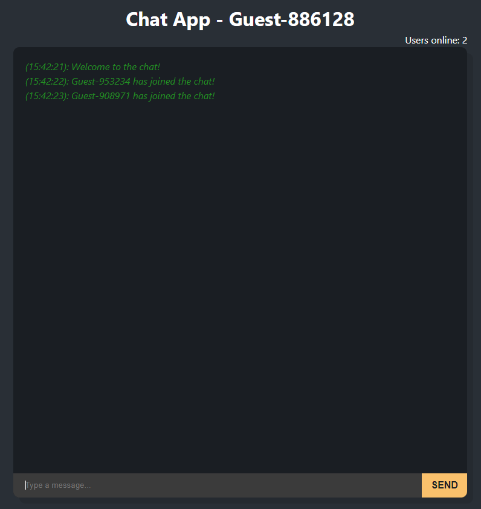

<a name="readme-top"></a>

<!-- PROJECT LOGO -->
<br />
<div align="center">
  <a href="https://github.com/Arkcoz/chat-app">
    
  </a>

  <h3 align="center">Chat app</h3>

  <p align="center">
    A basic multiplayer chat application, built using React, Express, and Socket.io.
  </p>
</div>


<!-- ABOUT THE PROJECT -->
## About The Project


### Built With

This section should list any major frameworks/libraries used to bootstrap your project. Leave any add-ons/plugins for the acknowledgements section. Here are a few examples.

* [![React][React.js]][React-url]
* [Express](https://expressjs.com/)
* [Socket.io](https://socket.io/)


<!-- GETTING STARTED -->
## Getting Started



### Front-End with React

  ```sh
  npm install

  ```

  ```sh
  npm run dev
  ```

### Back-End with React

  ```sh
  npm install
  ```

  ```sh
  npm run dev
  ```